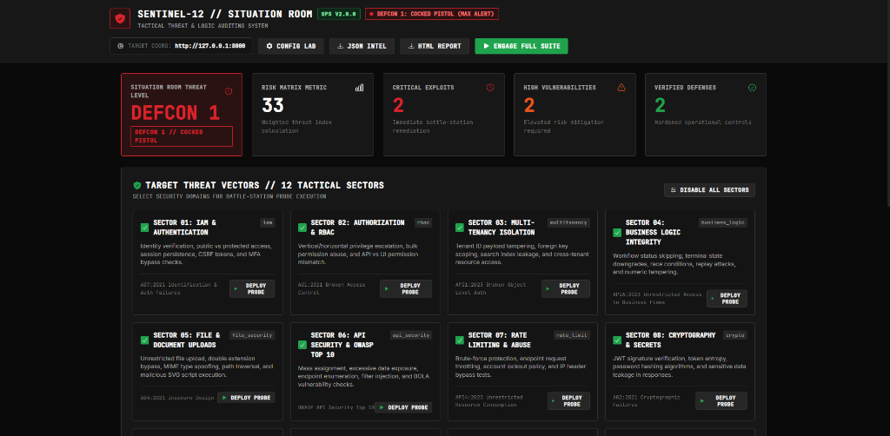
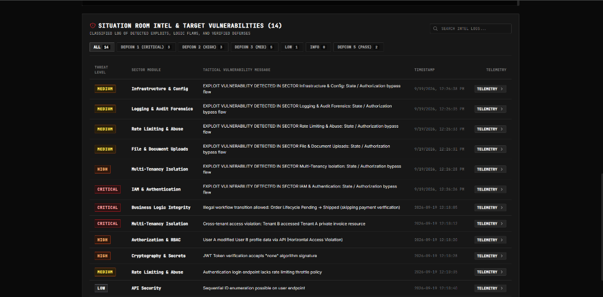

# Sentinel-12 Security Protocol

A modular, enterprise-grade penetration testing suite covering 12 critical security domains.

[](LICENSE)
[](https://www.python.org/)
[](https://github.com/primasdevlabs/sentinel/stargazers)
[](https://github.com/primasdevlabs/sentinel/network/members)
[](https://github.com/primasdevlabs/sentinel/issues)
[](https://owasp.org/)

[Repository](https://github.com/primasdevlabs/sentinel) | [Report Bug](https://github.com/primasdevlabs/sentinel/issues) | [Request Feature](https://github.com/primasdevlabs/sentinel/issues)

---




---

## Tech Stack


---

## Overview

Sentinel-12 is an open-source security testing suite designed to evaluate web applications and APIs against enterprise security standards. It automates penetration testing across 12 distinct security domains ranging from authentication and authorization to multi-tenancy, rate limiting, and supply chain vulnerability analysis.

---

## Key Features

- **12 Security Domains**: Comprehensive coverage including IAM, RBAC, Multi-Tenancy, Business Logic, File Uploads, API Security, Rate Limiting, Cryptography, Logging, Infrastructure, Supply Chain, and Human Processes.
- **Modular Engine**: Execute individual test modules or run the complete suite on demand.
- **Multi-Role Authentication**: Simulates concurrent user sessions (Admin, Standard Users, Multi-tenant agencies, and Unauthenticated visitors).
- **Flexible Reporting**: Output findings to JSON for automated CI/CD pipelines or styled HTML dashboards for human auditing.
- **Risk Score Algorithm**: Calculates weighted risk metrics to help security teams prioritize remediation efforts.

---

## Security Domains Covered

| Domain | Name | Focus & Coverage |
| :--- | :--- | :--- |
| **IAM** | Identity, Auth & Session | Session management, CSRF validation, MFA enforcement, credential handling |
| **RBAC** | Authorization & Access | Vertical/horizontal privilege escalation, broken function-level authorization |
| **Multi-Tenancy** | Data Isolation | Cross-tenant data leaks, scoping checks, boundary validation |
| **Business Logic** | Workflow Integrity | State machine bypass, race conditions, workflow sequence tampering |
| **File Security** | Upload Handling | Unrestricted file upload, MIME type spoofing, path traversal |
| **API Security** | OWASP API Top 10 | Mass assignment, excessive data exposure, endpoint enumeration |
| **Rate Limit** | Throttling & Abuse | Brute-force protection, endpoint throttling, lockout policies |
| **Crypto** | Secrets & Encryption | Password hashing, JWT validation, token entropy, sensitive data exposure |
| **Audit** | Logging & Forensics | Security event logging, log injection vulnerability, audit trails |
| **Supply Chain** | Dependency Risk | Vulnerable packages, abandoned dependencies, third-party risks |
| **Infrastructure** | Deployment Security | Debug mode leaks, exposed sensitive files, test route accessibility |
| **Human Process** | Operational Security | Default credentials, over-permissioned administrative roles |

---

## Quick Start

### 1. Prerequisites & Installation

Clone the repository and install required dependencies:

```bash
git clone https://github.com/primasdevlabs/sentinel.git
cd sentinel
pip install requests pyyaml
```

### 2. Configuration

Sentinel-12 supports **Environment Variables**, a **Custom `.sentinel` Config File**, `.env` files, or `config.yaml`.

#### Option A: Environment Variables (Recommended for CI/CD)

```bash
export SENTINEL_BASE_URL="https://your-target-app.example.com"
export SENTINEL_ADMIN_SESSION="your_admin_session_cookie"
export SENTINEL_USER_A_SESSION="your_user_a_session_cookie"
```

#### Option B: Custom `.sentinel` Config File

Copy the template to create a `.sentinel` file in your root directory (automatically discovered):

```bash
cp .sentinel.example .sentinel
```

```yaml
# .sentinel
base_url: "https://your-target-app.example.com"
admin_session: "your_admin_session_cookie"
user_a_session: "your_user_a_session_cookie"
user_b_session: "your_user_b_session_cookie"
agency_a_session: "your_agency_a_session_cookie"
agency_b_session: "your_agency_b_session_cookie"
verbose: false
```

#### Option C: `.env` File

Copy `.env.example` to `.env`:

```bash
cp .env.example .env
```

---

### 3. Running Tests

Execute the full suite or target specific modules:

```bash
# Run all 12 security modules
python runner.py --config config.yaml

# Run specific modules
python runner.py --config config.yaml --modules iam rbac api_security

# Generate an HTML report dashboard
python runner.py --config config.yaml --output report.html --format html

# Enable verbose logging
python runner.py --config config.yaml --verbose
```

### 4. React Security UI Dashboard (DEFCON 1 Situation Room)

Sentinel includes a React web dashboard built with `@heroicons/react` for interactive security suite management, telemetry inspection, and DEFCON threat monitoring.

#### Building the UI Bundle

To install dependencies and build the production assets:

```bash
cd frontend
npm install
npm run build
```

#### Running the UI Dashboard

You can launch the dashboard using either the Python web server or the React development server:

```bash
# Option A: Launch Production Web Dashboard via Python (serves built dist/)
python web_server.py

# Option B: Launch React Development Server (Hot Module Replacement)
cd frontend
npm run dev
```

#### Dashboard Previews


---

## Available Test Modules

The suite includes the following command-line module identifiers:

- `iam` - Identity, Authentication & Session Security
- `rbac` - Authorization & RBAC Integrity
- `multitenancy` - Multi-Tenancy & Data Isolation
- `business_logic` - Business Logic & Workflow Integrity
- `file_security` - File & Document Security
- `api_security` - API Security (OWASP API Top 10)
- `rate_limit` - Rate Limiting & Abuse Controls
- `crypto` - Cryptography & Secrets Management
- `audit` - Logging, Audit & Forensics
- `supply_chain` - Supply Chain & Dependency Risk
- `infrastructure` - Infrastructure & Deployment Security
- `human_process` - Human-Driven & Process Attacks

---

## Understanding Results

### Severity Matrix

| Severity | Description | Action Required |
| :--- | :--- | :--- |
| **CRITICAL** | Severe vulnerability allowing remote code execution or full data compromise | Immediate remediation required |
| **HIGH** | Significant flaw such as privilege escalation or cross-tenant leakage | Urgent attention needed |
| **MEDIUM** | Moderate vulnerability like missing rate limits or sensitive info disclosure | Remediate in next cycle |
| **LOW** | Minor issue such as verbose headers or sequential IDs | Address as practical |
| **INFO** | Informational finding requiring manual verification | Review for context |
| **PASSED** | Security control verified and working as expected | No action needed |

### Risk Score Calculation

Sentinel calculates an aggregate risk score using weighted values:

```
Risk Score = (CRITICAL x 10) + (HIGH x 5) + (MEDIUM x 2) + (LOW x 1)
```

---

## Report Formats

### JSON Output

Structured JSON reports can be generated for CI/CD integration:

```json
{
  "metadata": {
    "target": "http://127.0.0.1:8000",
    "start_time": "2026-09-19T12:00:00",
    "duration_seconds": 45.2
  },
  "findings": [
    {
      "severity": "critical",
      "message": "Broken Object Level Authorization detected on API endpoint",
      "details": { "endpoint": "/api/users/123", "status_code": 200 }
    }
  ],
  "summary": {
    "critical": 1,
    "high": 0,
    "medium": 2,
    "low": 1,
    "info": 0,
    "passed": 48
  }
}
```

### HTML Dashboard

Interactive HTML reports contain:
- Summary dashboard metrics
- Interactive severity filtering (All, Critical, High, Medium, Low, Passed)
- Detailed finding tracebacks and raw payload details
- Target metadata and total execution duration

---

## Advanced Usage

### Python SDK (`sentinel_sdk`)

Sentinel includes a native Python SDK for CI/CD pipeline integration, automated security quality gates, and `pytest` execution. See [SDK.md](SDK.md) for full API reference and detailed use cases.

#### Installation

```bash
pip install -e .
```

#### Quick Usage

```python
from sentinel_sdk import SentinelClient, SentinelConfig, SecurityAssertionError

# Configure and run client
config = SentinelConfig(base_url="http://127.0.0.1:8000", verbose=True)
client = SentinelClient(config)

# Run security modules
client.run_modules(["iam", "rbac", "business_logic"])

# Export HTML report
client.export_html("sdk_report.html")

# CI/CD Quality Gate Assertion
client.assert_no_critical_vulnerabilities()
```

#### Pytest Integration

```python
import pytest
from sentinel_sdk import SentinelClient, SentinelConfig

@pytest.fixture
def sentinel():
    config = SentinelConfig(base_url="http://127.0.0.1:8000")
    return SentinelClient(config)

def test_iam_compliance(sentinel):
    findings = sentinel.run_modules(["iam"])
    assert not any(f.severity.value == "critical" for f in findings)
```


### Extending with Custom Modules

Create custom modules by subclassing `BaseSecurityTest`:

```python
from base_test import BaseSecurityTest, Severity

class CustomSecurityCheck(BaseSecurityTest):
    def run_tests(self):
        r = self.request(self.sessions['admin'], 'GET', '/custom-endpoint')
        if r and r.status_code == 200:
            self.log(Severity.PASSED, "Custom endpoint security verified")
        else:
            self.log(Severity.HIGH, "Custom endpoint unexpected response", {"status": r.status_code if r else None})
```

---

## Security Best Practices & Authorized Usage

> [!WARNING]
> **Authorized Testing Only**: This security protocol must ONLY be tested against your own domain, your own web application, or systems where you have explicit, written authorization to perform penetration testing. Unauthorized testing against third-party domains is illegal and strictly prohibited.

- **Own Domain / Authorized Target Only**: Only configure target URLs (`base_url`) that belong to your organization or for which you hold explicit testing authorization.
- **Environment Isolation**: Perform security testing in dedicated staging or isolated development environments.
- **Dedicated Test Accounts**: Use test accounts created specifically for automated security testing rather than active production user accounts.
- **Monitoring & IDS Alerts**: Be aware that automated probes simulate real attack vectors and may trigger IDS/WAF alerts or temporary IP lockout policies.

---

## References

- [OWASP Top 10 Web Application Security Risks](https://owasp.org/www-project-top-ten/)
- [OWASP API Security Top 10](https://owasp.org/www-project-api-security/)
- [CWE Top 25 Most Dangerous Software Weaknesses](https://cwe.mitre.org/top25/)
- [NIST Cybersecurity Framework](https://www.nist.gov/cyberframework)

---

## Contributions

Contributions are welcome! Please follow these steps to contribute to Sentinel:

1. Fork the repository.
2. Create a feature branch (`git checkout -b feature/new-module`).
3. Commit your changes (`git commit -m 'Add new security module'`).
4. Push to the branch (`git push origin feature/new-module`).
5. Open a Pull Request.

### Contributors

[](https://github.com/primasdevlabs/sentinel/graphs/contributors)

---

## License

This project is licensed under the [MIT License](LICENSE) - see the [LICENSE](LICENSE) file for details.

Copyright (c) 2026 Primas Dev Labs
