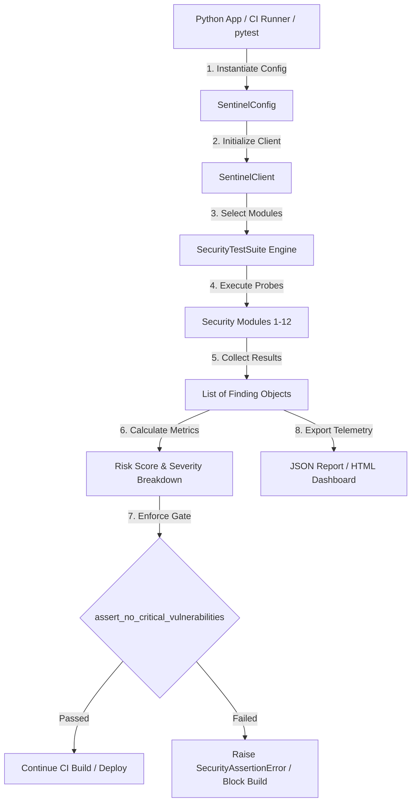
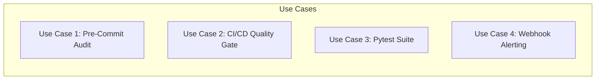

# Sentinel Python SDK (`sentinel_sdk`)

The Sentinel Python SDK provides a programmatic interface for automated security testing, CI/CD pipeline quality gates, and `pytest` test suite integration.

---

## Architecture & Flow



---

## Data Shapes & Schemas

### 1. `SentinelConfig` Shape

```python
class SentinelConfig:
    base_url: str = "http://127.0.0.1:8000"
    admin_session: Optional[str] = None
    user_a_session: Optional[str] = None
    user_b_session: Optional[str] = None
    agency_a_session: Optional[str] = None
    agency_b_session: Optional[str] = None
    verbose: bool = False
    timeout: int = 10
    delay: float = 0.1
```

### 2. `Finding` Object Schema

```json
{
  "severity": "critical",
  "message": "BOLA / IDOR vulnerability in tenant data endpoint",
  "details": {
    "endpoint": "/api/v1/records/1002",
    "http_method": "GET",
    "response_code": 200,
    "leak_detected": true
  },
  "timestamp": 1758282400.123
}
```

### 3. `Severity` Enum Values

| Enum Value | Level Name | Risk Weight | Description |
| :--- | :--- | :--- | :--- |
| `Severity.CRITICAL` | `critical` | 10 pts | Severe exploit potential (RCE, BOLA, Auth Bypass) |
| `Severity.HIGH` | `high` | 5 pts | High impact vulnerability (Privilege escalation, SQLi) |
| `Severity.MEDIUM` | `medium` | 2 pts | Moderate security flaw (XSS, Rate limit bypass) |
| `Severity.LOW` | `low` | 1 pt | Low risk issue (Info disclosure, missing headers) |
| `Severity.INFO` | `info` | 0 pts | Informational finding or manual check prompt |
| `Severity.PASSED` | `passed` | 0 pts | Security control test passed cleanly |

---

## Installation

### Local Development Mode
```bash
pip install -e .
```

### Direct Git Dependency (Production / CI Runners)
```bash
pip install git+https://github.com/primasdevlabs/sentinel.git
```

---

## Primary API Methods

### `SentinelClient`

- **`SentinelClient(base_url: str, config_file: Optional[str] = None, verbose: bool = False)`**
  Instantiates a new client configured with a target base URL or a path to a `config.yaml` file.

- **`set_session(role: str, session_cookie: str) -> SentinelClient`**
  Dynamically injects authentication session tokens for roles: `'admin'`, `'user_a'`, `'user_b'`, `'agency_a'`, or `'agency_b'`.

- **`run_modules(modules: List[str]) -> List[Finding]`**
  Executes specific security domains by name (e.g., `["iam", "rbac", "business_logic"]`).

- **`run_all() -> List[Finding]`**
  Executes all 12 security domain modules.

- **`get_findings(severity: Optional[Union[Severity, str]] = None) -> List[Finding]`**
  Returns logged findings, optionally filtered by severity level.

- **`calculate_risk_score() -> int`**
  Calculates the total aggregate risk score using weighted severity scores.

- **`assert_no_critical_vulnerabilities()`**
  Raises `SecurityAssertionError` if any `CRITICAL` findings were recorded.

- **`assert_max_risk_score(max_allowed: int = 10)`**
  Raises `SecurityAssertionError` if the calculated risk score exceeds the allowed threshold.

- **`export_json(output_file: str)`**
  Exports all findings and metadata to a structured JSON file.

- **`export_html(output_file: str)`**
  Generates an interactive, standalone HTML security report.

---

## Use Cases & Code Examples



### Use Case 1: Pre-Commit Local Security Audit

Run a fast audit script against your local development environment before opening a pull request:

```python
from sentinel_sdk import SentinelClient, SentinelConfig

def pre_commit_security_check():
    config = SentinelConfig(
        base_url="http://localhost:8000",
        user_a_session="dev_session_user_a",
        verbose=True
    )
    client = SentinelClient(config)
    
    # Audit identity and authorization modules
    findings = client.run_modules(["iam", "rbac", "api"])
    
    print(f"Audit Complete. Risk Score: {client.calculate_risk_score()}")
    client.export_html("local_security_report.html")

if __name__ == "__main__":
    pre_commit_security_check()
```

---

### Use Case 2: CI/CD Pipeline Security Quality Gate

Enforce zero critical vulnerabilities in GitHub Actions workflows:

```yaml
# .github/workflows/security-gate.yml
name: Sentinel Security Gate

on:
  pull_request:
    branches: [ main ]

jobs:
  security-audit:
    runs-on: ubuntu-latest
    steps:
      - uses: actions/checkout@v3

      - name: Set up Python
        uses: actions/setup-python@v4
        with:
          python-version: '3.10'

      - name: Install Sentinel SDK
        run: |
          pip install git+https://github.com/primasdevlabs/sentinel.git

      - name: Run Sentinel Security Gate Probe
        env:
          TARGET_URL: ${{ secrets.STAGING_URL }}
          ADMIN_TOKEN: ${{ secrets.STAGING_ADMIN_COOKIE }}
        run: |
          python -c "
          from sentinel_sdk import SentinelClient, SentinelConfig
          import os

          config = SentinelConfig(
              base_url=os.environ['TARGET_URL'],
              admin_session=os.environ['ADMIN_TOKEN']
          )
          client = SentinelClient(config)
          client.run_all()
          client.export_json('security_report.json')
          client.assert_no_critical_vulnerabilities()
          client.assert_max_risk_score(max_allowed=15)
          "
```

---

### Use Case 3: `pytest` Security Test Integration

Incorporate security assertions directly into your existing `pytest` test suite:

```python
# test_security_suite.py
import pytest
from sentinel_sdk import SentinelClient, SentinelConfig, Severity

@pytest.fixture
def sentinel():
    config = SentinelConfig(base_url="http://127.0.0.1:8000")
    return SentinelClient(config)

def test_rbac_authorization_boundaries(sentinel):
    findings = sentinel.run_modules(["rbac"])
    critical_rbac = [f for f in findings if f.severity == Severity.CRITICAL]
    assert len(critical_rbac) == 0, f"RBAC privilege escalation detected: {critical_rbac}"

def test_multi_tenancy_isolation(sentinel):
    findings = sentinel.run_modules(["multitenancy"])
    assert sentinel.calculate_risk_score() < 5, "Multi-tenancy risk score exceeded threshold"
```

---

### Use Case 4: Custom Slack / Teams Webhook Alerts

Automatically parse security findings and dispatch real-time alerts when security regressions occur:

```python
import requests
from sentinel_sdk import SentinelClient, SentinelConfig, Severity

SLACK_WEBHOOK_URL = "https://hooks.slack.com/services/YOUR/WEBHOOK/URL"

def run_and_notify():
    client = SentinelClient(base_url="https://staging.example.com")
    findings = client.run_all()
    
    criticals = client.get_findings(Severity.CRITICAL)
    if criticals:
        slack_payload = {
            "text": f"🚨 *Sentinel Security Alert*: {len(criticals)} CRITICAL vulnerabilities detected on staging!",
            "attachments": [
                {
                    "color": "#dc3545",
                    "title": f.message,
                    "text": f"Endpoint: {f.details.get('endpoint', 'N/A')}"
                }
                for f in criticals
            ]
        }
        requests.post(SLACK_WEBHOOK_URL, json=slack_payload)

if __name__ == "__main__":
    run_and_notify()
```
